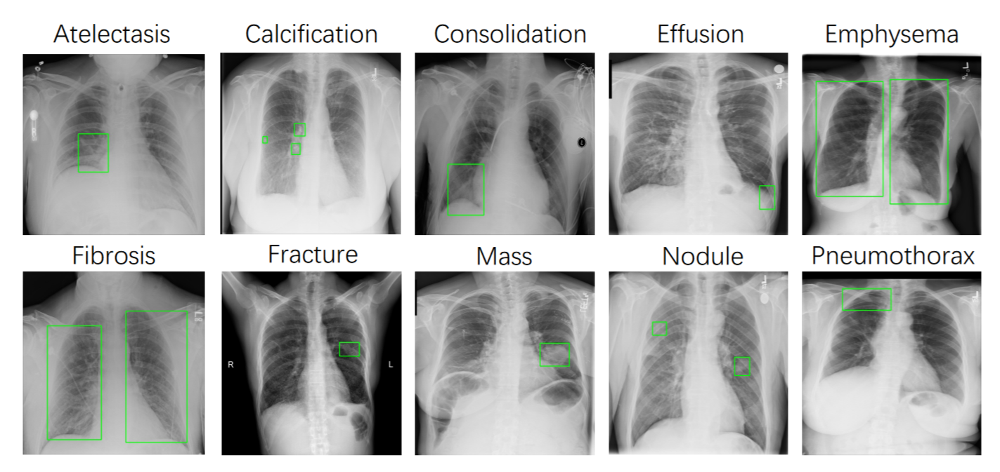

# ChestX-Det10 数据集

> **作者/来源**：Karen-Helene Støverud, David Bouget, André Pedersen, Hakon Olav Leira, Thomas Langø, Erlend Fagertun Hofstad  
> **机构**：SINTEF, Department of Health Research  
> **发布时间**：2022 年（公开日期未完整提供）  
> **数据集地址**：[GitHub 项目地址](https://github.com/Deepwise-AILab/ChestX-Det10-Dataset)  
> **论文地址**：[arXiv-2010.10298](https://arxiv.org/abs/2010.10298)（挑战赛相关研究）  

---

## 一、简介

**ChestX-Det10** 是一个用于胸部疾病实例检测的医学影像数据集，源自 [NIH ChestX-14 数据集](https://nihcc.app.box.com/v/ChestX14)，包含 **3,543 张胸部 X 光图像**。该数据集由三位经过认证的放射科医师共同标注，覆盖 **10 种常见胸部疾病或异常**，包括：

- 肺不张（Atelectasis）
- 钙化（Calcification）
- 实变（Consolidation）
- 积液（Effusion）
- 肺气肿（Emphysema）
- 纤维化（Fibrosis）
- 骨折（Fracture）
- 肿块（Mass）
- 结节（Nodule）
- 气胸（Pneumothorax）

标注信息以 **边界框（bounding box）** 形式提供，支持胸部疾病的自动检测与分析，适用于医学图像分割、目标检测等任务。


---

## 二、数据组成

### 1. **元信息**
| 维度 | 模态 | 任务类型 | 解剖结构 | 解剖区域 | 类别数 | 数据量 | 文件格式 |
|------|------|----------|----------|----------|--------|--------|----------|
| 2D | X-ray | 实例检测（Instance Detection） | 胸部 | 胸部 | 10 | 3,543 张 | PNG |

### 2. **图像尺寸统计**
- **最小值**：`[1024, 1024]`
- **中位数**：`[1024, 1024]`
- **最大值**：`[1024, 1024]`  
> 所有图像已统一调整为 **1024×1024 像素**，便于模型处理。

### 3. **标签信息统计**
| 疾病种类 | 实例数量 |
|----------|----------|
| Effusion | 2,092 |
| Pneumothorax | 211 |
| Atelectasis | 340 |
| Mass | 160 |
| Consolidation | 2,537 |
| Fracture | 661 |
| Fibrosis | 738 |
| Emphysema | 298 |
| Nodule | 955 |
| Calcification | 347 |

> **注意**：类别分布存在显著不平衡（如 `Consolidation` 和 `Effusion` 数量远高于其他类别），训练模型时需考虑采样策略。

---

## 三、数据可视化

### 1. **边界框标注**
每张图像的标注包含疾病区域的 **矩形边界框（Bounding Box）**，标注文件格式为 JSON，支持与主流目标检测框架（如 COCO、YOLO）兼容。

### 2. **原始图像示例**
- **输入图像**：1024×1024 像素的胸部 X 光图像。
- **标注叠加**：边界框直接标注在图像上，标注类别与颜色对应。

---

## 四、文件结构

### 1. **整体目录结构**
基于实际的ChestX-Det10数据集，经过COCO到YOLO格式转换和图像格式标准化处理后的完整目录结构：

```
ChestX-Det10/
├── train/                          # 训练集目录
│   ├── images/                     # 训练图像 (2,974张PNG)
│   └── labels/                     # 训练标签 (YOLO格式.txt文件)
├── test/                           # 测试集目录
│   ├── images/                     # 测试图像 (542张PNG)
│   └── labels/                     # 测试标签 (YOLO格式.txt文件)
├── backup_original_images/         # 原始图像备份目录
│   ├── train/                      # 原始训练图像备份
│   ├── test/                       # 原始测试图像备份
│   ├── fix_chestx_det10.py        # 图像格式修复脚本
│   └── 修复报告.md                 # 图像修复详细报告
├── classes.txt                     # 类别名称文件 (10个疾病类别)
├── data.yaml                       # YOLO数据集配置文件
```

### 2. **核心文件说明**

#### **数据文件**
- **`train/images/`**: 包含2,974张训练用胸部X光图像（1024×1024像素，RGB格式）
- **`train/labels/`**: 对应的YOLO格式标注文件，每个.txt文件包含边界框坐标和类别信息
- **`test/images/`**: 包含542张测试用胸部X光图像
- **`test/labels/`**: 测试集对应的YOLO格式标注文件

#### **配置文件**
- **`classes.txt`**: 包含10种胸部疾病类别名称：
  ```
  Atelectasis
  Calcification  
  Consolidation
  Effusion
  Emphysema
  Fibrosis
  Fracture
  Mass
  Nodule
  Pneumothorax
  ```
  
- **`data.yaml`**: YOLO数据集配置文件，定义训练/测试路径和类别信息

#### **备份与工具**
- **`backup_original_images/`**: 原始图像完整备份，保留处理前的L模式和RGBA模式图像
- **`fix_chestx_det10.py`**: 图像格式标准化脚本，解决libpng警告问题
- **`修复报告.md`**: 详细记录图像格式修复过程和结果统计

### 3. **数据量统计**
| 目录 | 图像数量 | 标签文件数量 | 总大小(约) |
|------|----------|--------------|------------|
| train/images/ | 2,974 | - | ~3.2GB |
| train/labels/ | - | 2,974 | ~5MB |
| test/images/ | 542 | - | ~580MB |
| test/labels/ | - | 542 | ~1MB |
| backup_original_images/ | 3,543 | - | ~3.8GB |

### 4. **使用说明**
- **训练**: 使用`train/`目录进行模型训练
- **测试**: 使用`test/`目录进行模型评估
- **配置**: `data.yaml`可直接用于YOLOv5/v8/v11训练
- **备份**: `backup_original_images/`保留原始数据，支持重新处理

---

## 五、数据处理与优化

### 1. **图像格式标准化**
原始数据集存在图像格式不一致问题，会导致训练时出现libpng警告：

**问题分析：**
- 98.9% 图像为L模式（灰度）
- 1.1% 图像为RGBA模式（含透明通道）
- 1个图像含有ICC配置文件冲突

**解决方案：**
使用 `fix_chestx_det10.py` 脚本统一转换为RGB格式：
- L模式 → RGB：复制灰度通道到三个颜色通道
- RGBA模式 → RGB：白色背景合成，移除透明通道
- 移除所有ICC配置文件
- 自动备份原始图像

**处理结果：**
- ✅ 所有3,543张图像统一为RGB格式
- ✅ 消除libpng警告
- ✅ 保持图像质量和诊断信息
- ✅ 训练兼容性显著提升

## 六、引用与扩展

### 1. **相关资源**
- **GitHub 项目**：[https://github.com/Deepwise-AILab/ChestX-Det10-Dataset](https://github.com/Deepwise-AILab/ChestX-Det10-Dataset)
- **NIH ChestX-14 原始数据**：[https://nihcc.app.box.com/v/ChestX14](https://nihcc.app.box.com/v/ChestX14)

### 2. **推荐引用**
```bibtex
@inproceedings{wang2017chestx,
  title={ChestX-ray8: Hospital-scale Chest X-ray Database and Benchmarks on Weakly-Supervised Classification and Localization of 10 Chest Diseases},
  author={Wang, Xiaosong and Peng, Yifan and Lu, Le and Lu, Zhiyuan and Bagheri, Mohammadhadi and Summers, Ronald M},
  booktitle={CVPR},
  year={2017}
}
```