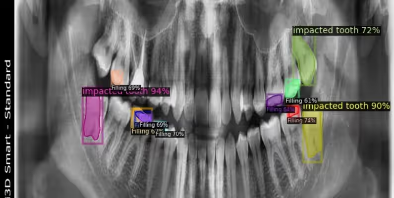

# Dental X-Ray Computational Vision Segmentation 数据集

> **作者/来源**：Arshs Workspace Radio  
> **机构**：未提供具体机构信息  
> **发布时间**：2024年1月  
> **数据集地址**：[Kaggle 数据集页面](https://www.kaggle.com/datasets/henriquerezermosqur/dental-x-ray-computacional-vision-segmentation/data)  
> **原始数据源**：[Universe Roboflow](https://universe.roboflow.com/arshs-workspace-radio/vzrad2)  

---

## 一、简介

**Dental X-Ray Computational Vision Segmentation** 是一个专门用于牙科X光影像分析的精选医学影像数据集，源自Kaggle（处理后）和Universe Roboflow（原始数据）平台。该数据集包含 **8,188张高质量的牙科X光图像**，专门设计用于计算机视觉的分割任务。

数据集覆盖 **14种不同的牙科特征类别**，包括：

- 龋齿（Caries）
- 牙冠（Crown）  
- 充填物（Filling）
- 植入物（Implant）
- 下颌管（Mandibular Canal）
- 缺失牙齿（Missing teeth）
- 根尖周病变（Periapical lesion）
- 残根（Retained root）
- 根管治疗（Root Canal Treatment）
- 牙根片段（Root Piece）
- 阻生牙（Impacted tooth）
- 上颌窦（Maxillary sinus）
- 牙列不齐（Malaligned）
- 其他相关结构

标注信息以 **精确的分割掩码** 形式提供，支持牙科疾病和解剖结构的自动分割与分析，适用于医学图像分割、目标检测等任务。


---

## 二、数据组成

### 1. **元信息**
| 维度 | 模态 | 任务类型 | 解剖结构 | 解剖区域 | 类别数 | 数据量 | 文件格式 |
|------|------|----------|----------|----------|--------|--------|----------|
| 2D | X-ray | 分割（Segmentation） | 牙科 | 口腔颌面部 | 14 | 8,188 张 | JPG+PNG |

### 2. **图像尺寸统计**
- **最小值**：`[640, 640]`
- **中位数**：`[640, 640]`
- **最大值**：`[640, 640]`  
> 所有图像已统一调整为 **640×640 像素**，便于模型处理和训练。

### 3. **数据集划分**
| 子集 | 图像数量 | 占比 | 用途 |
|------|----------|------|------|
| 训练集 | 4,772 | 58.3% | 模型训练 |
| 验证集 | 2,071 | 25.3% | 模型验证和调优 |
| 测试集 | 1,345 | 16.4% | 最终性能评估 |
| **总计** | **8,188** | **100%** | - |

> **注意**：较大的验证集比例（25%）特别有利于模型的充分验证和调优，确保开发的算法在实际应用中具有高度的可靠性和准确性。

### 4. **标签信息统计**
基于转换后的YOLO格式数据集统计（已清理问题类别）：

| 类别ID | 类别名称 | 训练集标注数 | 验证集标注数 | 测试集标注数 | 总标注数 |
|--------|----------|-------------|-------------|-------------|----------|
| 0 | Caries | 3,988 | 1,532 | 1,015 | 6,535 |
| 1 | Crown | 4,616 | 1,529 | 903 | 7,048 |
| 2 | Filling | 15,358 | 7,145 | 4,842 | 27,345 |
| 3 | Implant | 1,018 | 181 | 151 | 1,350 |
| 4 | Malaligned | 2 | 5 | 3 | 10 |
| 5 | Mandibular Canal | 506 | 75 | 36 | 617 |
| 6 | Missing teeth | 1,832 | 422 | 281 | 2,535 |
| 7 | Periapical lesion | 2,570 | 959 | 476 | 4,005 |
| 8 | Retained root | 2 | 6 | 29 | 37 |
| 9 | Root Canal Treatment | 7,552 | 2,887 | 1,829 | 12,268 |
| 10 | Root Piece | 1,466 | 317 | 255 | 2,038 |
| 11 | Impacted tooth | 8,918 | 4,188 | 2,782 | 15,888 |
| 12 | Maxillary sinus | 384 | 54 | 24 | 462 |

**总标注数**: 80,138个（训练集：48,212，验证集：19,300，测试集：12,626）

> **类别分布特点**：
> - `Filling`（充填物）和`Impacted tooth`（阻生牙）标注数量最多
> - `Malaligned`（牙列不齐）和`Retained root`（残根）标注较少
> - 类别分布存在一定不平衡，训练时需考虑采样策略

---

## 三、数据可视化

### 1. **分割掩码标注**
每张图像配有对应的分割掩码（PNG格式），提供像素级的精确标注：
- **原始图像**：640×640像素的牙科X光图像（JPG格式）
- **分割掩码**：对应的二值化或多类别掩码图像（PNG格式）
- **标注格式**：COCO JSON格式，包含多边形分割信息

### 2. **数据示例**
- **输入图像**：高质量的牙科X光片，清晰显示牙齿结构
- **掩码叠加**：精确的分割边界，标注各种牙科特征和病变

---

## 四、文件结构

### 1. **原始COCO格式目录结构**
```
DXR/
├── Dental_X_Ray/                   # 主数据目录
│   ├── train/                      # 训练集图像目录
│   │   ├── train_mask/             # 训练集掩码目录
│   │   │   └── [mask_files.png]   # PNG格式掩码文件
│   │   └── [image_files.jpg]      # JPG格式图像文件
│   ├── valid/                      # 验证集图像目录
│   │   ├── train_mask/             # 验证集掩码目录（原文件名）
│   │   │   └── [mask_files.png]   # PNG格式掩码文件
│   │   └── [image_files.jpg]      # JPG格式图像文件
│   └── test/                       # 测试集图像目录
│       ├── test_mask/              # 测试集掩码目录
│       │   └── [mask_files.png]   # PNG格式掩码文件
│       └── [image_files.jpg]      # JPG格式图像文件
├── train_annotations.coco.json    # 训练集COCO格式标注
├── valid_annotations.coco.json    # 验证集COCO格式标注
└── test_annotations.coco.json     # 测试集COCO格式标注
```

### 2. **转换后YOLO格式目录结构**
经过格式转换和类别清理后的完整目录结构：

```
Dental_X_Ray/
├── train/                          # 训练集目录
│   ├── images/                     # 训练图像 (4,772张JPG)
│   └── labels/                     # 训练标签 (YOLO格式.txt文件)
├── val/                            # 验证集目录  
│   ├── images/                     # 验证图像 (2,071张JPG)
│   └── labels/                     # 验证标签 (YOLO格式.txt文件)
├── test/                           # 测试集目录
│   ├── images/                     # 测试图像 (1,345张JPG) 
│   └── labels/                     # 测试标签 (YOLO格式.txt文件)
├── backup_coco_format/             # 原始COCO格式数据备份
│   ├── train_annotations.coco.json # 原始训练集标注
│   ├── valid_annotations.coco.json # 原始验证集标注
│   └── test_annotations.coco.json  # 原始测试集标注
├── classes.txt                     # 类别名称文件 (13个清理后类别)
├── dataset.yaml                    # YOLO数据集配置文件
└── README.md                       # 数据集说明文档
```

### 3. **核心文件说明**

#### **数据文件**
- **`train/images/`**: 包含4,772张训练用牙科X光图像（640×640像素，JPG格式）
- **`train/labels/`**: 对应的YOLO格式标注文件，每个.txt文件包含边界框坐标和类别信息
- **`val/images/`**: 包含2,071张验证用牙科X光图像
- **`test/images/`**: 包含1,345张测试用牙科X光图像

#### **配置文件**
- **`classes.txt`**: 包含13种清理后的牙科特征类别名称
- **`dataset.yaml`**: YOLO数据集配置文件，定义训练/验证/测试路径和类别信息

### 4. **数据量统计**
| 目录 | 图像数量 | 标签文件数量 | 总大小(约) |
|------|----------|--------------|------------|
| train/ | 4,772 | 4,772 | ~2.8GB |
| val/ | 2,071 | 2,071 | ~1.2GB |
| test/ | 1,345 | 1,345 | ~0.8GB |
| backup_coco_format/ | - | 3 | ~50MB |
| **总计** | **8,188** | **8,191** | **~4.9GB** |

---

## 五、数据处理与优化

### 1. **格式转换流程**
原始数据集采用COCO分割格式，为了适应目标检测任务，进行了以下处理：

**转换步骤：**
1. **COCO → YOLO转换**：使用专门的转换脚本将分割掩码转换为边界框
2. **类别清理**：移除无标注类别（vzrad2），修复拼写错误（croen→Crown）
3. **ID重映射**：将类别ID重新映射为连续的0-12序列
4. **数据验证**：确保图像-标签对应关系完整

**处理结果：**
- ✅ 成功转换80,138个分割标注为边界框格式
- ✅ 类别数从15个清理为13个有效类别
- ✅ 所有数据集图像-标签完美匹配
- ✅ 支持主流YOLO框架直接使用

### 2. **质量保证**
- **数据完整性**：所有图像都有对应的标签文件
- **格式统一**：图像统一为640×640像素JPG格式
- **标注精度**：保持原始分割标注的高精度信息
- **类别平衡**：提供详细的类别分布统计，便于采样策略制定

---

## 六、应用场景与价值

### 1. **临床应用**
- **辅助诊断**：开发牙科疾病自动检测系统
- **教育培训**：为牙科学生提供标准化学习资源
- **质量控制**：辅助放射科医师进行影像质量评估
- **治疗规划**：支持数字化治疗方案制定

### 2. **研究价值**
- **算法开发**：训练和优化深度学习模型
- **性能对比**：提供标准化的评估基准
- **技术创新**：推动牙科AI技术发展
- **跨域研究**：支持医学影像处理方法研究

### 3. **技术特点**
- **高质量标注**：专业的分割级别标注
- **标准化格式**：支持多种深度学习框架
- **充足数据量**：8,188张图像满足模型训练需求
- **平衡验证集**：25%的验证集比例确保模型可靠性

---

## 七、引用与扩展

### 1. **相关资源**
- **Kaggle数据集**：[https://www.kaggle.com/datasets/henriquerezermosqur/dental-x-ray-computacional-vision-segmentation/data](https://www.kaggle.com/datasets/henriquerezermosqur/dental-x-ray-computacional-vision-segmentation/data)
- **Roboflow原始数据**：[https://universe.roboflow.com/arshs-workspace-radio/vzrad2](https://universe.roboflow.com/arshs-workspace-radio/vzrad2)

### 2. **推荐引用**
```bibtex
@misc{vzrad2_dataset,
  title = {vzrad2 Dataset},
  type = {Open Source Dataset},
  author = {Arshs Workspace Radio},
  howpublished = {\url{https://universe.roboflow.com/arshs-workspace-radio/vzrad2}},
  url = {https://universe.roboflow.com/arshs-workspace-radio/vzrad2},
  journal = {Roboflow Universe},
  publisher = {Roboflow},
  year = {2024},
  month = {sep},
}
```

---