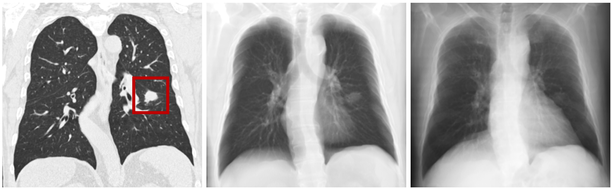

# NODE21 数据集

> **作者/来源**：Ecem Sogancioglu, Keelin Murphy, Ernst T. Scholten, Luuk H. Boulogne, Martin Schalekamp, Cornelia M. Schaefer-Prokop, Bram van Ginneken  
> **机构**：Radboud University Medical Center, Netherlands  
> **发布时间**：2022 年  
> **数据集地址**：[Zenodo Dataset](https://zenodo.org/record/6362906)  
> **论文地址**：[arXiv:2401.02192](https://doi.org/10.48550/arXiv.2401.02192)  

---

## 一、简介

**NODE21** 是一个专门用于肺结节检测的医学影像数据集，包含 **4,882 张正面胸部 X 光图像**。该数据集由胸部放射科医师标注，采用YOLO格式进行目标检测任务。数据集包含有结节和无结节两类图像：

- 训练集：3,905 张图像（907 张有结节，1,202 个结节标注；2,998 张无结节）
- 验证集：487 张图像（113 张有结节，140 个结节标注；374 张无结节）
- 测试集：490 张图像（114 张有结节，134 个结节标注；376 张无结节）

标注信息采用 **YOLO格式** 提供，专门用于肺结节的目标检测，适用于医学图像中结节的自动识别与定位任务。该数据集特别关注胸部 X 光片中结节检测的挑战性，因为 X 光片是投影图像，结节可能被其他解剖结构遮挡。


---

## 二、数据组成

### 1. **元信息**
| 维度 | 模态 | 任务类型 | 解剖结构 | 解剖区域 | 类别数 | 数据量 | 文件格式 |
|------|------|----------|----------|----------|--------|--------|----------|
| 2D | X-ray | 目标检测 | 胸部 | 肺部 | 1 | 4,882 张 | JPG |

### 2. **图像尺寸统计**
- **标准尺寸**：JPG格式，尺寸不一
- **格式**：JPG格式（已转换）
- **预处理**：建议统一调整为标准尺寸以获得更好的训练效果
> 建议预处理时统一调整为 **1024×1024 像素** 或其他标准尺寸。

### 3. **标签信息统计**
| 数据集 | 总图像数 | 有结节图像 | 无结节图像 | 结节标注数 |
|--------|----------|------------|------------|------------|
| 训练集 | 3,905 | 907 | 2,998 | 1,202 |
| 验证集 | 487 | 113 | 374 | 140 |
| 测试集 | 490 | 114 | 376 | 134 |
| **总计** | **4,882** | **1,134** | **3,748** | **1,476** |

> **注意**：数据集包含大量无结节图像（76.8%），这符合临床实际情况，但训练时需考虑正负样本平衡策略。

---

## 三、数据可视化

### 1. **YOLO格式标注**
每张图像对应一个同名的.txt标注文件，采用YOLO格式的 **归一化边界框坐标**。标注格式为：
```
class_id center_x center_y width height
```
其中所有坐标值都已归一化到[0,1]范围内，class_id=0代表结节。

### 2. **原始图像示例**
- **输入图像**：JPG格式的正面胸部 X 光图像
- **标注信息**：YOLO格式的归一化边界框坐标

---

## 四、文件结构

### 1. **整体目录结构**
基于实际的NODE21数据集的完整目录结构：

```
NODE21/
├── train/                          # 训练集
│   ├── images/                     # 训练图像 (3,905张JPG)
│   └── labels/                     # 训练标注 (1,202个TXT文件)
├── val/                            # 验证集
│   ├── images/                     # 验证图像 (487张JPG)
│   └── labels/                     # 验证标注 (140个TXT文件)
├── test/                           # 测试集
│   ├── images/                     # 测试图像 (490张JPG)
│   └── labels/                     # 测试标注 (134个TXT文件)
└── data.yaml                       # YOLO配置文件
```

### 2. **核心文件说明**

#### **数据文件**
- **`train/images/`**: 包含3,905张训练用胸部X光图像（JPG格式）
- **`train/labels/`**: 包含1,202个训练标注文件（TXT格式，YOLO格式），对应有结节的图像
- **`val/images/`**: 包含487张验证用胸部X光图像（JPG格式）
- **`val/labels/`**: 包含140个验证标注文件（TXT格式，YOLO格式），对应有结节的图像
- **`test/images/`**: 包含490张测试用胸部X光图像（JPG格式）
- **`test/labels/`**: 包含134个测试标注文件（TXT格式，YOLO格式），对应有结节的图像

> **重要**：无结节的图像没有对应的标注文件，这是YOLO格式的标准做法。

#### **配置文件**
- **`data.yaml`**: YOLO训练配置文件，包含数据集路径和类别信息：
  ```yaml
  train: train
  val: val
  test: test
  nc: 1
  names: ['nodule']
  ```

#### **数据来源**
数据集包含来自以下公开数据集的图像：
- **JSRT**: 日本放射学会胸部数据库
- **PadChest**: 大规模胸部X光数据集  
- **ChestX-ray14**: NIH胸部X光14类疾病数据集
- **Open-I**: NIH开放获取生物医学图像数据库

### 3. **数据量统计**
| 目录 | 图像数量 | 标注文件数量 | 总大小(约) |
|------|----------|--------------|------------|
| train/ | 3,905 | 1,202 | ~1.8GB |
| val/ | 487 | 140 | ~230MB |
| test/ | 490 | 134 | ~235MB |

### 4. **使用说明**
- **目标检测**: 使用YOLO格式进行结节检测训练
- **数据加载**: 通过`data.yaml`配置文件加载数据集
- **类别信息**: 单一类别"nodule"（结节）
- **标注格式**: 每个TXT文件包含归一化的边界框坐标
- **训练建议**: 建议统一图像尺寸以获得更好的训练效果

---

## 五、预处理详情

### 1. **标准化预处理流程**
数据集采用OPENCXR库进行预处理，包括以下步骤：

**A. 边界区域去除**
- 移除图像中的同质边界区域

**B. 强度归一化**  
- 基于能量的图像强度值归一化
- 参考相关论文实现标准化算法

**C. 肺视野分割**
- 自动分割肺视野区域
- 将图像裁剪到肺部区域

**D. 尺寸标准化**
- 调整图像大小为1024×1024像素
- 保留原始纵横比
- 在较短边使用填充处理

### 2. **处理优势**
- ✅ 统一的图像外观和尺寸
- ✅ 减少背景噪声干扰  
- ✅ 突出肺部区域特征
- ✅ 提高检测算法性能

---

## 六、挑战任务

### 1. **检测任务**
**目标**: 在正面胸部X光片中检测肺结节
**输出**: 结节边界框列表和置信度分数
**评估**: 
- 主要指标：AUC分数
- FROC分析：平均假阳性率下的灵敏度
- IOU阈值：0.5（命中标准）

### 2. **生成任务**  
**目标**: 在指定位置生成逼真的肺结节
**输入**: 无结节胸部X光片 + 位置JSON文件
**输出**: 含生成结节的图像
**评估**: 生成图像训练的检测器在测试集上的性能

### 3. **测试集**
- **实验测试集**: 281张图像（166张阳性）
- **最终测试集**: 298+张图像（多中心、多设备）
- **人类基准**: 12位放射科医生标注，提供专家性能对比

---

## 七、引用与扩展

### 1. **相关资源**
- **Zenodo数据集**: [https://zenodo.org/record/6362906](https://zenodo.org/record/6362906)
- **OPENCXR库**: 用于图像预处理的开源工具
- **LUNA16数据集**: CT结节补丁数据来源

### 2. **推荐引用**
```bibtex
@article{sogancioglu2024node21,
  title={NODE21: Lung Nodule Detection and Generation Challenge},
  author={Sogancioglu, Ecem and Murphy, Keelin and Scholten, Ernst T and Boulogne, Luuk H and Schalekamp, Martin and Schaefer-Prokop, Cornelia M and van Ginneken, Bram},
  journal={arXiv preprint arXiv:2401.02192},
  year={2024},
  doi={10.48550/arXiv.2401.02192}
}
```
