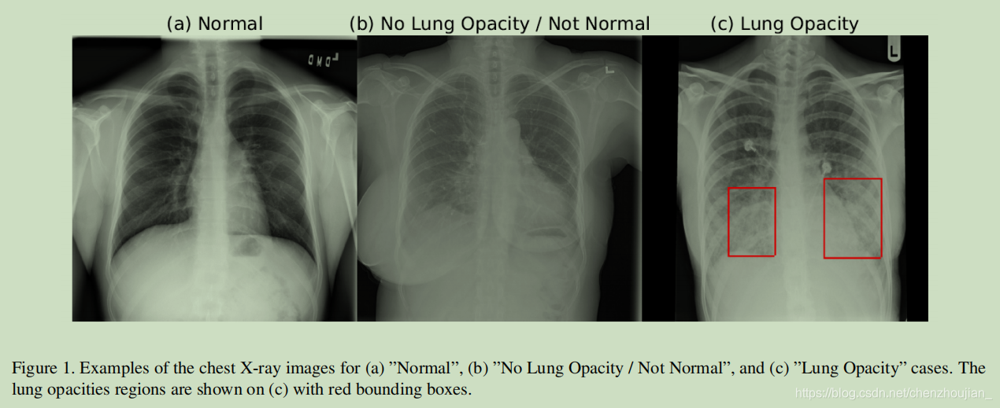

# RSNA 肺炎检测挑战数据集

> **作者/来源**：RSNA (Radiological Society of North America)  
> **机构**：北美放射学会  
> **发布时间**：2018 年  
> **数据集地址**：[Kaggle Competition](https://www.kaggle.com/c/rsna-pneumonia-detection-challenge)  
> **论文地址**：[RSNA Challenge](https://pubs.rsna.org/doi/10.1148/radiol.2019191293)  

---

## 一、简介

**RSNA 肺炎检测挑战数据集** 是一个专门用于肺炎检测的医学影像数据集，包含 **26,686 张胸部 X 光图像**。该数据集由北美放射学会发起，旨在通过机器学习自动定位肺部阴影（opacity），以优先进行检查并加快诊断速度。数据集包含有肺炎和无肺炎两类图像：

- 训练集：21,149 张图像（4,758 张有肺炎阴影，7,485 个阴影标注；16,391 张无肺炎阴影）
- 测试集：5,537 张图像（1,256 张有肺炎阴影，1,925 个阴影标注；4,281 张无肺炎阴影）

标注信息采用 **YOLO格式** 提供，专门用于肺炎相关阴影的目标检测，适用于医学图像中肺炎的自动识别与定位任务。该数据集特别关注肺炎导致的阴影检测，区别于其他原因（如肿瘤、胸腔积液等）导致的阴影。

---

## 二、数据组成

### 1. **元信息**
| 维度 | 模态 | 任务类型 | 解剖结构 | 解剖区域 | 类别数 | 数据量 | 文件格式 |
|------|------|----------|----------|----------|--------|--------|----------|
| 2D | X-ray | 目标检测 | 胸部 | 肺部 | 1 | 26,686 张 | JPG |

### 2. **图像尺寸统计**
- **标准尺寸**：JPG格式，尺寸不一（原始DICOM转换）
- **格式**：JPG格式（已从DICOM转换）
- **预处理**：建议统一调整为标准尺寸并进行去黑边处理
> 原始图像来自DICOM格式，部分图像存在黑边，建议预处理时统一调整为 **1024×1024 像素**。

### 3. **标签信息统计**
| 数据集 | 总图像数 | 有肺炎图像 | 无肺炎图像 | 阴影标注数 |
|--------|----------|------------|------------|------------|
| 训练集 | 21,149 | 4,758 | 16,391 | 7,485 |
| 测试集 | 5,537 | 1,256 | 4,281 | 1,925 |
| **总计** | **26,686** | **6,014** | **20,672** | **9,410** |

> **注意**：数据集包含大量无肺炎图像（77.5%），这符合临床实际情况，但训练时需考虑正负样本平衡策略。肺炎图像平均包含约1.56个阴影标注。

---

## 三、数据可视化

### 1. **YOLO格式标注**
每张有肺炎的图像对应一个同名的.txt标注文件，采用YOLO格式的 **归一化边界框坐标**。标注格式为：
```
class_id center_x center_y width height
```
其中所有坐标值都已归一化到[0,1]范围内，class_id=0代表肺炎阴影（lung_opacity）。

### 2. **原始图像示例**
- **输入图像**：JPG格式的胸部 X 光图像（原始DICOM转换）
- **标注信息**：YOLO格式的归一化边界框坐标，标识肺炎相关阴影区域

---

## 四、文件结构

### 1. **整体目录结构**
基于实际的RSNA_Lung数据集的完整目录结构：

```
RSNA_Lung/
├── train/                          # 训练集
│   ├── images/                     # 训练图像 (21,149张JPG)
│   ├── labels/                     # 训练标注 (4,758个TXT文件)
│   └── labels.cache                # YOLO缓存文件
├── test/                           # 测试集
│   ├── images/                     # 测试图像 (5,537张JPG)
│   └── labels/                     # 测试标注 (1,256个TXT文件)
└── data.yaml                       # YOLO配置文件
```

### 2. **核心文件说明**

#### **数据文件**
- **`train/images/`**: 包含21,149张训练用胸部X光图像（JPG格式）
- **`train/labels/`**: 包含4,758个训练标注文件（TXT格式，YOLO格式），对应有肺炎阴影的图像
- **`test/images/`**: 包含5,537张测试用胸部X光图像（JPG格式）
- **`test/labels/`**: 包含1,256个测试标注文件（TXT格式，YOLO格式），对应有肺炎阴影的图像

> **重要**：无肺炎阴影的图像没有对应的标注文件，这是YOLO格式的标准做法。

#### **配置文件**
- **`data.yaml`**: YOLO训练配置文件，包含数据集路径和类别信息：
  ```yaml
  train: train
  val: test
  test: test
  nc: 1
  names: ['lung_opacity']
  ```

#### **数据来源**
数据集来自NIH胸部X光数据集的子集，具有以下特点：
- **原始格式**: DICOM文件（*.dcm）包含header metadata和raw image arrays
- **转换格式**: JPG格式，便于深度学习处理
- **标注方式**: 专业放射科医师标注肺炎相关阴影
- **质量说明**: 医学图像标注具有一定主观性，标签准确率非100%

### 3. **数据量统计**
| 目录 | 图像数量 | 标注文件数量 | 总大小(约) |
|------|----------|--------------|------------|
| train/ | 21,149 | 4,758 | ~8.5GB |
| test/ | 5,537 | 1,256 | ~2.2GB |

### 4. **使用说明**
- **目标检测**: 使用YOLO格式进行肺炎阴影检测训练
- **数据加载**: 通过`data.yaml`配置文件加载数据集
- **类别信息**: 单一类别"lung_opacity"（肺炎阴影）
- **标注格式**: 每个TXT文件包含归一化的边界框坐标
- **预处理建议**: 去除黑边、统一图像尺寸、增强对比度

---

## 五、挑战背景

### 1. **医学背景**
**肺炎诊断的复杂性**：
- 肺炎在胸部X光片上表现为阴影（opacity）增加
- 许多其他疾病也会产生类似阴影：肺水肿、出血、肺不张、肺癌等
- 胸腔积液也会在胸部X光片上产生阴影
- 患者拍片位置和吸气深度会影响图像外观

**阴影类型区分**：
- **肺炎阴影**: 边界模糊，呈弥散状，感染沿正常气道扩散
- **肿瘤阴影**: 边界清晰，圆形结构，与正常肺组织区别明显
- **其他阴影**: 胸腔积液、血管斑块、心脏扩大等

### 2. **比赛目标**
- **主要任务**: 自动检测和定位肺炎相关的肺部阴影
- **排除范围**: 非肺炎原因导致的阴影（肿瘤、积液等）
- **临床价值**: 优先检查、加速诊断、减轻医生工作负担

### 3. **数据特点**
- **标注难度**: 放射科医师之间对阴影存在中等程度共识
- **边界模糊**: 肺炎阴影没有清晰的中心或边界
- **标注变异**: 不同医师的标注会有所差异
- **质量说明**: 标签远非100%准确，开发算法时需考虑这一点

---

## 六、预处理与增强

### 1. **DICOM文件处理**
原始数据为DICOM格式，包含丰富的元数据：
- **图像数据**: Raw image arrays for pixels
- **元数据**: 患者年龄、性别、拍摄位置等
- **处理工具**: 使用pydicom库进行访问和操作

### 2. **图像预处理建议**
**A. 黑边去除**
- 移除图像边缘的黑色区域
- 裁剪到有效的胸部区域

**B. 尺寸标准化**
- 统一调整为标准尺寸（如1024×1024）
- 保持纵横比，使用填充处理

**C. 对比度增强**
- 应用直方图均衡化
- 增强肺部与阴影的对比度

**D. 数据增强**
- 旋转、翻转、缩放
- 亮度和对比度调整
- 注意保持医学图像的诊断价值

### 3. **数据偏差注意事项**
- **拍摄位置偏差**: PA（后前位）与AP（前后位）存在差异
- **设备差异**: 不同X光机的成像特点
- **数据泄露风险**: 注意元数据特征的使用

---

## 七、引用与扩展

### 1. **相关资源**
- **Kaggle Competition**: [https://www.kaggle.com/c/rsna-pneumonia-detection-challenge](https://www.kaggle.com/c/rsna-pneumonia-detection-challenge)
- **NIH原始数据集**: ChestX-ray14数据集的子集
- **RSNA官方**: 北美放射学会肺炎检测挑战

### 2. **推荐引用**
```bibtex
@article{rsna2019pneumonia,
  title={RSNA Pneumonia Detection Challenge},
  author={RSNA},
  journal={Radiological Society of North America},
  year={2018},
  note={Kaggle Competition Dataset}
}
```