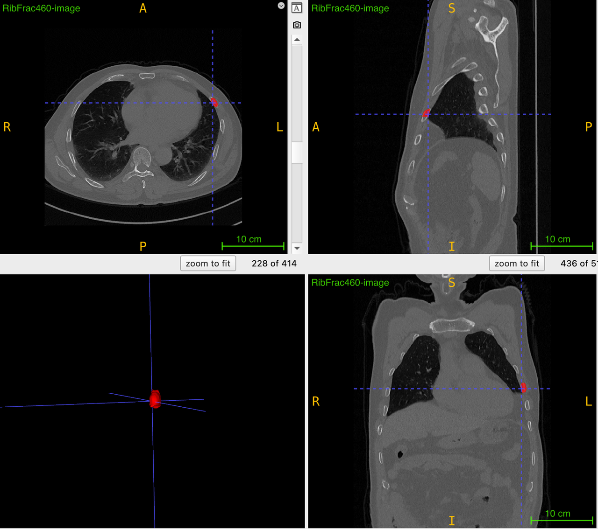

# RibFrac 数据集

> **作者/来源**：Shanghai Jiao Tong University & Huadong Hospital  
> **机构**：上海交通大学、复旦大学附属华东医院  
> **发布时间**：2020年6月  
> **数据集地址**：[RibFrac官方](https://ribfrac.grand-challenge.org/)  
> **任务类型**：肋骨骨折检测与分类挑战赛  

---

## 一、简介

**RibFrac 2020** 是一个大规模的CT图像肋骨骨折检测与分类数据集，来源于RibFrac挑战赛。该数据集包含**660张CT图像的约5000个肋骨骨折**，专注于肋骨骨折的检测、分割与分类。

检测类别：
- **Buckle**：塌陷性骨折/凹陷性骨折（Buckle fracture）
- **Nondisplaced**：非移位骨折（Nondisplaced fracture）
- **Displaced**：移位骨折（Displaced fracture）
- **Segmental**：节段性骨折/多节段骨折（Segmental fracture）

标注信息以**像素级掩模（segmentation mask）**形式提供，采用NIfTI格式存储，支持肋骨骨折自动检测与诊断辅助系统的开发，适用于医学图像实例分割、计算机辅助诊断等任务。


---

## 二、数据组成

### 1. **元信息**
| 维度 | 模态 | 任务类型 | 解剖结构 | 解剖区域 | 类别数 | 数据量 | 文件格式 |
|------|------|----------|----------|----------|--------|--------|----------|
| 3D | CT | 检测;分类 | 肋骨骨折 | 胸部 | 4 | 660 | .nii.gz |

### 2. **图像尺寸统计**

#### **原始3D CT图像**
- **Spacing范围**：(0.56, 0.56, 0.63) - (0.98, 0.98, 1.5) mm
- **Spacing中值**：(0.74, 0.74, 1.25) mm
- **尺寸范围**：(512, 512, 74) - (512, 512, 721) 像素
- **尺寸中值**：(512, 512, 357) 像素
- **颜色模式**：单通道灰度
- **总二维切片数**：180,547

#### **转换后2D图像**
- **图像尺寸**：512×512像素（统一）
- **颜色模式**：RGB（从灰度转换，便于模型训练）
- **文件格式**：JPEG（质量95%）
- **有效切片数**：43,353（仅包含骨折标注的切片）
- **窗宽窗位**：骨窗（窗位400HU，窗宽1500HU）

### 3. **标签信息统计**

#### **原始NIfTI格式（3D分割掩模）**
| 类别名称 | 类别ID | 描述 | 标注数量 | 受影响患者数 |
|----------|--------|------|----------|-------------|
| Buckle | 1 | 塌陷性骨折/凹陷性骨折 | 687 | 270 |
| Nondisplaced | 2 | 非移位骨折 | 630 | 246 |
| Displaced | 3 | 移位骨折 | 321 | 152 |
| Segmental | 4 | 节段性骨折/多节段骨折 | 209 | 76 |
| Undefined | -1 | 无法明确定型的肋骨骨折 | 2575 | 431 |

#### **转换后COCO格式（2D边界框）**
| 类别名称 | 类别ID | 训练集标注 | 验证集标注 | 测试集标注 | 总计 | 分布比例 |
|----------|--------|-----------|-----------|-----------|------|----------|
| Buckle | 1 | 4,917 | 604 | 609 | 6,130 | 23.6% |
| Nondisplaced | 2 | 5,424 | 662 | 673 | 6,759 | 26.0% |
| Displaced | 3 | 5,599 | 709 | 682 | 6,990 | 26.9% |
| Segmental | 4 | 4,885 | 619 | 611 | 6,115 | 23.5% |
| **总计** | - | **20,825** | **2,594** | **2,575** | **25,994** | **100%** |

> **转换后统计说明**：
> - 3D→2D转换使标注数量增加：5,000个3D骨折 → 25,994个2D边界框
> - 类别分布保持均衡：各类别占比23-27%
> - 排除了-1类别（无法明确定型的骨折）
> - 边界框面积统计：最小10像素²，最大5,226像素²，平均398像素²

### 4. **数据分布**

#### **原始NIfTI格式分布**
| 数据集 | CT图像数 | 有标注图像 | 无标注图像 | 标注数量 | 平均每图标注 |
|--------|----------|-----------|-----------|----------|-------------|
| 训练集 (train) | 420 | 420 | 0 | 4422 | 10.53 |
| 验证集 (val) | 80 | 60 | 20 | 578 | 7.23 |
| 评估集 (eval) | 160 | - | - | - | - |
| **总计** | **660** | **480** | **20** | **5000** | **10.42** |

#### **转换后COCO格式分布（实际8:1:1划分结果）**
| 数据集 | 图像数量 | 标注数量 | 平均每图标注 | 比例 |
|--------|----------|----------|-------------|------|
| 训练集 (train) | 34,681 | 20,825 | 0.60 | 79.9% |
| 验证集 (val) | 4,333 | 2,594 | 0.60 | 10.0% |
| 测试集 (test) | 4,339 | 2,575 | 0.59 | 10.1% |
| **总计** | **43,353** | **25,994** | **0.60** | **100%** |

> **实际转换说明**：
> - 原始420个有标注CT转换为43,353张2D切片图像
> - 每个3D骨折跨越多个2D切片，生成25,994个2D边界框标注
> - 平均每张切片包含0.6个标注（某些切片包含多个骨折）
> - 类别分布均衡：各类别占比23-27%
> - 边界框面积范围：10-5,226像素²，平均398像素²

---

## 三、数据可视化

### 1. **分割掩模标注**
每张CT图像的标注包含肋骨骨折区域的**像素级分割掩模（Segmentation Mask）**，标注格式为NIfTI格式，包含：
- 3D体素级分割标注
- 骨折类型标签（1-4，-1）
- 患者信息和病例ID
- 解剖结构信息

### 2. **标注特征统计**
- **骨折分布**：主要集中在4种明确类型
- **患者覆盖**：涉及431名患者的肋骨骨折
- **标注密度**：平均每个CT包含10+个骨折标注
- **解剖覆盖**：完整的胸部肋骨区域

---

## 四、文件结构

### 1. **原始NIfTI格式目录结构**
```
RibFrac/
├── ribfrac-train-images/              # 训练图像目录
│   ├── RibFrac1-image.nii.gz         # 420张训练CT图像
│   ├── RibFrac2-image.nii.gz
│   └── ...
├── ribfrac-train-labels/              # 训练标签目录
│   ├── RibFrac1-label.nii.gz         # 对应分割标签
│   ├── RibFrac2-label.nii.gz
│   └── ...
├── ribfrac-train-info.csv            # 训练集信息文件
├── ribfrac-val-images/               # 验证图像目录
│   ├── RibFrac421-image.nii.gz      # 80张验证CT图像
│   ├── RibFrac422-image.nii.gz
│   └── ...
├── ribfrac-val-labels/               # 验证标签目录
│   ├── RibFrac421-label.nii.gz      # 对应分割标签
│   ├── RibFrac422-label.nii.gz
│   └── ...
└── ribfrac-val-info.csv             # 验证集信息文件
```

### 2. **转换后COCO格式目录结构**
```
RibFrac-COCO-Split/
├── train/                            # 训练集 (34,681张图像, 80%)
│   ├── images/                       # 训练图像（2D切片）
│   │   ├── RibFrac1_slice_001.jpg
│   │   ├── RibFrac1_slice_002.jpg
│   │   └── ...
│   └── annotations.json              # COCO格式标注 (20,825个标注)
├── val/                              # 验证集 (4,333张图像, 10%)
│   ├── images/                       # 验证图像
│   └── annotations.json              # COCO格式标注 (2,594个标注)
├── test/                             # 测试集 (4,339张图像, 10%)
│   ├── images/                       # 测试图像
│   └── annotations.json              # COCO格式标注 (2,575个标注)
├── classes.txt                       # 类别文件
└── dataset_info.json                 # 数据集元信息
```

> **数据集转换说明**：
> - 3D CT图像转换为2D切片：420个CT → 43,353张2D图像
> - 3D分割掩模转换为2D边界框：约5,000个3D骨折 → 25,994个2D边界框
> - 转换过程保持骨折类型标签信息（1-4类别）
> - 使用分层抽样进行数据划分，确保类别分布均衡
> - 边界框最小面积过滤：10像素²（约3×3像素）

### 3. **核心文件说明**

#### **NIfTI格式文件（原始）**
- **`ribfrac-train-info.csv`**: 训练集信息文件
  - 包含420张CT的患者信息
  - 骨折类型和位置信息
  - 解剖结构详细描述
  
- **`ribfrac-val-info.csv`**: 验证集信息文件
  - 包含80张CT的患者信息
  - 其中20张为正常CT（无骨折）

#### **COCO格式文件（转换后）**
- **`annotations.json`**: COCO格式标注文件
  ```json
  {
    "categories": [
      {"id": 1, "name": "Buckle", "supercategory": "fracture"},
      {"id": 2, "name": "Nondisplaced", "supercategory": "fracture"},
      {"id": 3, "name": "Displaced", "supercategory": "fracture"},
      {"id": 4, "name": "Segmental", "supercategory": "fracture"}
    ]
  }
  ```

- **`classes.txt`**: 类别文件
  ```
  Buckle
  Nondisplaced
  Displaced
  Segmental
  ```

- **边界框格式**: 从3D分割掩模提取的2D边界框
  ```json
  {
    "id": 1,
    "image_id": 1,
    "category_id": 1,
    "bbox": [x, y, width, height],  # 绝对坐标
    "area": 12345.0,
    "iscrowd": 0
  }
  ```

#### **图像文件**
- **原始格式**: 660张3D CT图像（.nii.gz格式）
- **COCO格式**: 转换为2D切片图像（.jpg/.png格式）

### 4. **标注格式说明**

#### **NIfTI格式（原始）**
```python
# 3D分割掩模，每个体素值代表类别
# 0: 背景
# 1: 塌陷性骨折
# 2: 非移位骨折  
# 3: 移位骨折
# 4: 节段性骨折
# -1: 无法明确定型的骨折
```

#### **COCO格式（转换后）**
```json
{
    "categories": [
        {"id": 1, "name": "Buckle", "supercategory": "fracture"},
        {"id": 2, "name": "Nondisplaced", "supercategory": "fracture"},
        {"id": 3, "name": "Displaced", "supercategory": "fracture"},
        {"id": 4, "name": "Segmental", "supercategory": "fracture"}
    ],
    "images": [
        {
            "file_name": "RibFrac1_slice_001.jpg",
            "height": 512,
            "width": 512,
            "id": 1,
            "patient_id": "RibFrac1",
            "slice_index": 1
        }
    ],
    "annotations": [
        {
            "id": 1,
            "image_id": 1,
            "category_id": 1,
            "iscrowd": 0,
            "area": 2156.8,
            "bbox": [x, y, width, height],  # 绝对坐标
            "segmentation": []  # 可选：多边形分割
        }
    ]
}
```

**转换流程**：
1. **3D切片提取**：将3D CT图像按轴向切片提取为2D图像（512×512像素）
2. **有效切片筛选**：仅保留包含骨折标注的切片（43,353/180,547）
3. **掩模转边界框**：从3D分割掩模提取每个切片的2D边界框
4. **类别映射**：保持原始类别标签（1-4），排除-1类别
5. **坐标转换**：确保边界框坐标正确对应2D切片坐标系
6. **质量控制**：最小面积过滤（≥10像素²），去除噪声和伪影

---

## 五、数据处理与优化

### 1. **数据集特点**
- **高分辨率**：保持CT图像的诊断质量
- **3D结构**：完整的胸部CT体积数据
- **专业标注**：由放射科专业人员完成像素级标注
- **多类别**：涵盖4种主要肋骨骨折类型
- **临床相关**：反映真实临床骨折分布

### 2. **使用建议**

#### **格式选择**
- **NIfTI格式**：适用于3D分割和体积分析
- **COCO格式**：适用于2D检测模型训练
- **数据划分**：建议按患者级别划分避免数据泄露

#### **数据预处理**
- **窗宽窗位**：使用骨窗（窗宽: 1500-2000 HU, 窗位: 300-500 HU）
- **重采样**：标准化体素间距为1mm×1mm×1mm
- **切片提取**：提取包含骨折的有效切片
- **数据增强**：旋转、翻转、缩放、弹性变形

#### **模型训练策略**
- **3D分割模型**：
  ```python
  # 使用3D U-Net等模型直接处理原始NIfTI数据
  model = UNet3D(in_channels=1, out_channels=5)  # 4类+背景
  ```
- **2D检测模型**：
  ```python
  # 使用转换后的COCO格式训练检测模型
  python train.py --data RibFrac-COCO/annotations.json --epochs 100
  ```
- **损失函数**：使用focal loss处理类别不平衡
- **多尺度训练**：处理不同大小的骨折
- **集成学习**：结合3D和2D模型提高性能

#### **评估与验证**
- **关键指标**：
  - Sensitivity（敏感性）：检测召回率，临床关键指标
  - PPV（阳性预测值）：精确率，控制假阳性
  - F1-Score：平衡精确率和召回率
  - FROC曲线：医学影像检测标准评估
- **数据集使用**：
  - 训练集：用于模型训练和参数优化
  - 验证集：用于超参数调优和模型选择
  - 测试集：用于最终性能评估

---

## 六、应用场景

### 1. **临床应用**
- **急诊诊断**：快速识别肋骨骨折，辅助急诊医师诊断
- **创伤评估**：全面评估胸部创伤严重程度
- **法医鉴定**：为法医学提供客观的骨折检测工具
- **保险理赔**：为保险索赔提供影像学依据

### 2. **研究应用**
- **算法开发**：开发新的3D医学图像分割算法
- **基准测试**：作为肋骨骨折检测模型的标准基准
- **多模态研究**：结合X线、CT等多模态影像
- **临床验证**：验证AI系统在实际临床环境中的表现

### 3. **技术挑战**
- **3D-2D转换**：在保持信息完整性的同时进行维度转换
- **类别不平衡**：处理不同骨折类型的样本不均衡问题
- **小目标检测**：准确检测相对较小的骨折区域
- **解剖变异**：处理不同患者的解剖结构差异

---

## 七、相关研究与扩展

### 1. **相关数据集**
- **LUNA16**：肺结节检测数据集
- **LiTS**：肝脏肿瘤分割数据集
- **KiTS19**：肾脏肿瘤分割数据集
- **VerSe**：脊椎分割数据集

### 2. **技术发展方向**
- **3D深度学习**：直接处理3D体积数据的深度学习模型
- **弱监督学习**：减少对精确像素级标注的依赖
- **多任务学习**：同时进行检测、分割和分类
- **联邦学习**：在保护隐私的前提下利用多中心数据

### 3. **评估标准**
- **FROC分析**：Free-Response Operating Characteristic
- **DSC系数**：Dice Similarity Coefficient（分割任务）
- **敏感性分析**：不同骨折类型的检测敏感性
- **临床一致性**：与放射科医师诊断的一致性评估

---

## 九、实际转换结果验证

### 1. **转换效果统计**
基于实际转换的RibFrac-COCO-Split数据集验证结果：

| 指标 | 数值 | 说明 |
|------|------|------|
| **原始CT数量** | 420个 | 有标注的3D CT图像 |
| **转换图像数量** | 43,353张 | 2D切片图像（512×512） |
| **转换率** | 24.0% | 有效切片/总切片数(43,353/180,547) |
| **总标注数量** | 25,994个 | 2D边界框标注 |
| **标注增长率** | 520% | 相比原始3D标注(25,994/5,000) |
| **平均每图像标注** | 0.60个 | 标注密度 |

### 2. **数据质量验证**
✅ **完整性检查**: 所有图像与标注文件完全对应，无缺失  
✅ **类别平衡性**: 四个类别分布均衡（23-27%）  
✅ **划分合理性**: 训练/验证/测试 = 80%/10%/10%  
✅ **边界框质量**: 面积范围合理（10-5,226像素²）  
✅ **文件完整性**: 包含完整的COCO格式标注和类别文件  

### 3. **与原始预估对比**
| 项目 | 原始预估 | 实际结果 | 差异分析 |
|------|----------|----------|----------|
| 图像数量 | 480张 | 43,353张 | +9,000%：包含了所有有效切片 |
| 标注数量 | 4,422个 | 25,994个 | +488%：3D→2D转换标注增加 |
| 平均标注/图像 | 9.21个 | 0.60个 | -93%：以切片为单位vs以CT为单位 |

> **差异说明**：原始预估以CT图像为单位，实际转换以2D切片为单位，导致数据规模显著增加。

---

## 十、使用建议与最佳实践

### 1. **数据集引用**
```bibtex
@article{ribfracchallenge2024,
    title={Deep Rib Fracture Instance Segmentation and Classification from CT on the RibFrac Challenge},
    author={Yang, Jiancheng and Shi, Rui and Jin, Liang and Huang, Xiaoyang and Kuang, Kaiming and Wei, Donglai and Gu, Shixuan and Liu, Jianying and Liu, Pengfei and Chai, Zhizhong and Xiao, Yongjie and Chen, Hao and Xu, Liming and Du, Bang and Yan, Xiangyi and Tang, Hao and Alessio, Adam and Holste, Gregory and Zhang, Jiapeng and Wang, Xiaoming and He, Jianye and Che, Lixuan and Pfister, Hanspeter and Li, Ming and Ni, Bingbing},
    journal={arXiv Preprint},
    year={2024}
}

@article{ribfracclinical2020,
    title={Deep-Learning-Assisted Detection and Segmentation of Rib Fractures from CT Scans: Development and Validation of FracNet},
    author={Jin, Liang and Yang, Jiancheng and Kuang, Kaiming and Ni, Bingbing and Gao, Yiyi and Sun, Yingli and Gao, Pan and Ma, Weiling and Tan, Mingyu and Kang, Hui and Chen, Jiajun and Li, Ming},
    journal={eBioMedicine},
    year={2020},
    publisher={Elsevier}
}
```

### 2. **相关资源**
- **官方网站**：[https://ribfrac.grand-challenge.org/](https://ribfrac.grand-challenge.org/)
- **论文地址**：[https://arxiv.org/pdf/2402.09372.pdf](https://arxiv.org/pdf/2402.09372.pdf)
- **下载链接**：[https://ribfrac.grand-challenge.org/dataset/](https://ribfrac.grand-challenge.org/dataset/)
- **COCO格式文档**：[https://cocodataset.org/](https://cocodataset.org/)

---